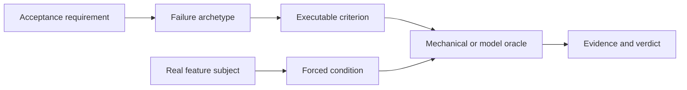
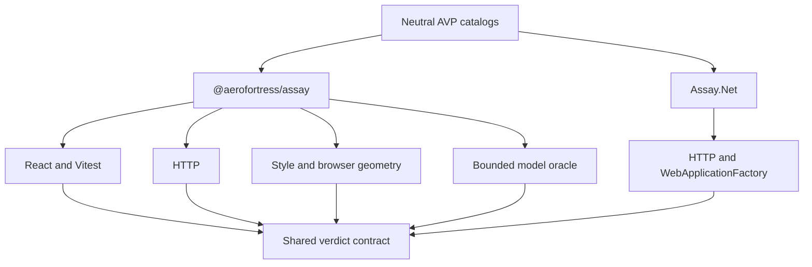

<p align="center">
  
</p>

<h1 align="center">Acceptance Verification Protocol</h1>

<p align="center"><strong>Deterministic proof that AI-built features actually work.</strong></p>

<p align="center">
  <a href="#quick-install-with-your-agent">Quick Install</a> |
  <a href="#getting-started">Getting Started</a> |
  <a href="#catalog">Catalog</a> |
  <a href="#architecture">Architecture</a> |
  <a href="#measured-evidence">Evidence</a>
</p>

<p align="center">
  <a href="https://github.com/lucasrgt/acceptance-verification-protocol/actions/workflows/ci.yml"></a>
  <a href="https://www.npmjs.com/package/@aerofortress/assay"></a>
  <a href="https://www.nuget.org/packages/Assay.Net"></a>
  <a href="LICENSE"></a>
</p>

AI coding agents are effective when a reliable verifier tells them whether the
work is correct. Many product requirements have no such verifier. A button can
render without performing its action, an error state can hide a failed request,
or an authorization rule can exist only in the client.

AVP turns subjective completion into executable acceptance criteria. A project
declares the subject under test, selects a reusable failure archetype, forces
the relevant conditions, and receives a machine-readable verdict. Empty or
unresolved proof is inconclusive, never green.

<table>
<tr><td><b>Behavior, not appearance</b></td><td>Verify observable effects, server authority, state transitions, failure handling, money, idempotency, navigation, and other product invariants.</td></tr>
<tr><td><b>Design on real substrates</b></td><td>Verify tokens, themes, contrast, accessibility, responsive geometry, overflow, RTL, focus, tap targets, and layout stability.</td></tr>
<tr><td><b>Escape-grounded catalog</b></td><td>Every shipped criterion comes from a real defect that escaped a real test suite and carries its provenance.</td></tr>
<tr><td><b>Calibrated verification</b></td><td>A verifier must fail the vulnerable reproduction and pass the corrected control before it contributes detection evidence.</td></tr>
<tr><td><b>Fail-closed outcomes</b></td><td>Failed, unresolved, unavailable, or empty evidence cannot be converted into acceptance.</td></tr>
<tr><td><b>Thin and language-neutral</b></td><td>The protocol defines the contract. Assay for JavaScript and Assay.Net for .NET run it through existing test substrates.</td></tr>
</table>

The repository ships two reference implementations over the same neutral
catalogs:

| Package | Runtime | Primary substrates |
| --- | --- | --- |
| [`@aerofortress/assay`](assay/) | Node 20+, ESM | React, Vitest, HTTP, jsdom, browser geometry, model judge |
| [`Assay.Net`](assay.net/) | .NET 10 | HTTP, `HttpClient`, `WebApplicationFactory` |

Both consume [`protocol/catalog.json`](protocol/catalog.json) and
[`protocol/design-catalog.json`](protocol/design-catalog.json). The .NET source
emits the canonical bytes, and both implementations enforce catalog
conformance.

---

## Quick install with your agent

Copy this prompt into a coding agent with terminal access:

```text
Integrate the Acceptance Verification Protocol into this repository.

Inspect the project before changing it. Select only the AVP reference
implementation and adapters required by the existing stack:

- @aerofortress/assay for JavaScript, TypeScript, React, HTTP, or design checks
- Assay.Net for .NET HTTP backends

Identify one concrete feature and its acceptance requirements. Map those
requirements to existing AVP archetypes. Add a co-located subject that exposes
the feature's real seams and a co-located verification file. For JavaScript,
use the canonical *.assay.test.* suffix so both Assay and Vitest discover it.

Run the repository's existing tests and the AVP verification. Do not weaken a
criterion, replace real effects with mocks that erase the behavior under test,
or treat unresolved or unavailable evidence as passing.

Preserve existing conventions and unrelated files. Report the packages added,
the subject and criteria verified, the commands run, and the final verdict.

Reference:
https://github.com/lucasrgt/acceptance-verification-protocol
```

### Manual installation

For React behavior verification:

```bash
npm install --save-dev \
  @aerofortress/assay \
  vitest jsdom \
  @testing-library/react \
  @testing-library/user-event \
  msw
```

For HTTP-only JavaScript verification, install Assay and your existing test
host. The HTTP adapter uses the platform `fetch` implementation:

```bash
npm install --save-dev @aerofortress/assay vitest
```

For .NET:

```bash
dotnet add package Assay.Net
```

Every optional substrate is an optional peer. Install only the adapters the
project actually uses.

---

## Getting started

### React and Vitest

Declare how Assay reaches the real feature seams:

```tsx
// features/send-message/send.subject.tsx
import type { ActionEffectSubject } from '@aerofortress/assay/react';
import { Composer } from './Composer';

export const sendMessage: ActionEffectSubject = {
  name: 'send-message',
  render: () => <Composer />,
  endpoint: {
    method: 'POST',
    path: 'http://localhost/api/messages',
  },
  action: {
    role: 'button',
    name: /send/i,
  },
  input: {
    role: 'textbox',
    name: /message/i,
  },
  draftSample: 'Hello',
};
```

Bind that subject to a catalog archetype:

```ts
// features/send-message/send.assay.test.ts
import { actionEffect } from '@aerofortress/assay';
import { defineVerification } from '@aerofortress/assay/react/vitest';
import { sendMessage } from './send.subject';

defineVerification(actionEffect, sendMessage);
```

Run every co-located verification:

```bash
npx assay verify
npx assay verify --json
```

Assay mounts the component, drives the declared control, forces success,
API-error, offline, and repeated-activation conditions through the available
seams, then emits one result per applicable criterion.

### .NET HTTP backend

```csharp
using Assay.Net;
using Assay.Net.Archetypes;

var verdict = await Runner.Run(
    Catalog.LoadDefault(),
    new RequestIdempotency(),
    "create-order",
    new RequestIdempotencySubject(
        BaseUrl: factoryUrl,
        CreatePath: "/orders"),
    transport: () => factory.CreateClient());

Console.WriteLine(Format.Verdict(verdict));
verdict.RequireAccepted();
```

Omit `transport` to verify a real HTTP endpoint. Supplying
`WebApplicationFactory.CreateClient` keeps the same HTTP semantics without
opening a socket.

### Choose a verification surface

| Surface | Entry point | What it verifies |
| --- | --- | --- |
| React DOM | `@aerofortress/assay/react` | User actions, requests, drafts, state, navigation, identity, and rendering |
| Vitest binding | `@aerofortress/assay/react/vitest` | Co-located verification discovery and host gating |
| HTTP | `@aerofortress/assay/http` | Server authority, authorization, money, callbacks, idempotency, and lifecycle rules |
| Design style | `@aerofortress/assay/design` | Tokens, themes, contrast, accessible names, and computed styles |
| Design geometry | `@aerofortress/assay/design/browser` | Overflow, overlap, responsive layout, RTL, tap targets, and layout shift |
| Model oracle | `@aerofortress/assay/judge` | Criteria that require bounded semantic judgment, such as icon meaning |
| .NET HTTP | `Assay.Net` | Catalog-driven backend verification over real or in-process HTTP |

The geometry tier uses an installed Chrome, Edge, or Brave through
`puppeteer-core`. It does not download a browser. `CHROME_PATH` can select an
explicit executable.

Read the complete [getting started guide](docs/getting-started.md) for React,
HTTP, design, and custom criteria.

---

## What AVP verifies

Traditional tests often prove that code executed. AVP focuses on whether the
feature's externally meaningful contract survived real conditions.

| Requirement | Acceptance proof |
| --- | --- |
| "The button works" | Activating the real control produces the declared external effect |
| "Errors are handled" | API failure and offline conditions remain honest and preserve recoverable user input |
| "Only authorized users can do this" | The server refuses cross-identity access and tampered authority |
| "Submitting twice is safe" | Repeated activation or retry does not duplicate the durable effect |
| "The amount is correct" | Integer monetary invariants survive transport, calculation, and presentation |
| "The screen matches the system" | Tokens, themes, contrast, semantics, and real browser geometry satisfy the declared criteria |

AVP complements unit, integration, end-to-end, type, and static-analysis
checks. It does not replace them.

---

## The protocol



| Concept | Meaning |
| --- | --- |
| `subject` | The real feature or service slice being verified, including the seams required to drive it |
| `archetype` | A reusable class of escaped failure |
| `criterion` | One mandatory invariant within an archetype |
| `condition` | The situation under which the invariant must hold, such as success, API error, offline, or double activation |
| `oracle` | The mechanical or bounded semantic decision procedure |
| `verdict` | Per-criterion evidence plus an aggregate outcome |

### Fail-closed outcomes

| Outcome or status | Meaning |
| --- | --- |
| `pass` | Every applicable criterion produced decided passing evidence |
| `fail` | At least one applicable criterion was violated |
| `not-applicable` | A criterion genuinely does not apply to the declared subject and remains visible |
| `unresolved` | Required evidence or an oracle was unavailable |
| `inconclusive` | The aggregate had unresolved or empty proof and must not pass the host gate |

Acceptance thresholds cannot waive a mandatory failure. One subject also
cannot borrow another subject's evidence merely because both use the same
criterion.

The normative contract and complete vocabulary live in
[`docs/PROTOCOL.md`](docs/PROTOCOL.md) and [`CONTEXT.md`](CONTEXT.md).

---

## Catalog

The current neutral catalog contains 41 archetypes and 70 criteria.

| Catalog | Archetypes | Criteria | Representative coverage |
| --- | ---: | ---: | --- |
| Behavior | 21 | 50 | Actions, data honesty, failure honesty, navigation, authorization, callbacks, money, lifecycle gates, idempotency, time, pagination, atomicity, credentials |
| Design | 20 | 20 | Tokens, themes, contrast, accessible names, composition, overflow, overlap, responsive layout, RTL, tap targets, focus, truncation, layout shift |

Each criterion includes:

- A stable identifier and protocol version.
- The condition under which it applies.
- Its required substrate and subject seams.
- The real fix commits from which it was mined.
- An oracle type and executable calibration coverage.

The shipped catalog contains transferable invariants, not product-specific
preferences. Domain criteria remain in the consuming repository and can use
the same public DSL without changing AVP's benchmark.

```ts
import {
  AvpFail,
  archetype,
  criterion,
  mechanical,
  runVerification,
} from '@aerofortress/assay';

const accountProtocol = archetype(
  'account-protocol-conformance',
  '0.1.0',
  () => {
    criterion(
      'exposes-canonical-account-protocol',
      'Every provider returns an id, currency, and integer balanceMinor.',
      { substrate: 'http' },
      mechanical(async ({ act, expect }) => {
        await act();
        expect.everyProviderIsCanonical();
      }),
    );
  },
);

await runVerification(
  'all-banks',
  accountProtocol,
  { probe: () => myProbe() },
);
```

See [ADR 0002](docs/adr/0002-custom-criteria-bring-your-own-off-catalog.md)
for the boundary between the public catalog and private domain criteria.

---

## Architecture

AVP is intentionally a thin protocol layer over test infrastructure projects
already use.

| Layer | Responsibility |
| --- | --- |
| L0 substrate | Vitest, Testing Library, MSW, browser layout, `fetch`, `HttpClient`, `WebApplicationFactory`, or an approved model |
| L1 core | DSL, protocol types, oracle routing, verdict composition, and formatting |
| L2 adapters | Mount, force a condition, drive the subject, and observe evidence for one substrate |
| L3 verdict | Pass, fail, not-applicable, or unresolved results plus evidence and aggregate outcome |



There is no AVP daemon, hosted service, configuration framework, or replacement
test runner. The `assay` command is a thin interface over the project's Vitest
host. See [ADR 0001](docs/adr/0001-thin-layer-not-a-framework.md) for the design
constraint.

### Repository map

```text
protocol/        Language-neutral behavior and design catalogs
assay/           JavaScript, TypeScript, React, HTTP, and design implementation
assay.net/       .NET HTTP implementation
docs/            Protocol, catalog, evidence, security, and architecture notes
```

---

## Measured evidence

AVP measures the verifier, not only its test suite. Every calibration pair
contains a vulnerable reproduction and a corrected control. The verifier must
detect the former without flagging the latter.

| Archetypes | Criteria referenced by tests | Calibration pairs | Detected | False alarms | Held-out pairs |
| ---: | ---: | ---: | ---: | ---: | ---: |
| 41 | 70 of 70 | 63 | 63 | 0 | 1 detected, 0 false alarms |

The measurement command executes both reference implementations, audits
catalog-to-test reach, fingerprints every scientific input, and rejects
evidence drift in CI:

```bash
cd assay
npm run measure:check
```

These results demonstrate the checked corpus at the recorded revision. They do
not claim universal defect detection or a statistically representative
external benchmark. The first frozen held-out case validates a previously
published authorization oracle against an external private-repository
permission escape.

Read the [measurement methodology](docs/measurements.md),
[machine-readable evidence](docs/measurements.json), [transfer protocol](docs/transfer.md),
and [defect ledger](docs/defect-ledger.md).

---

## Scope

| AVP does | AVP does not |
| --- | --- |
| Turn acceptance requirements into executable evidence | Generate product requirements |
| Force realistic success and failure conditions | Guarantee correctness without declared subject seams |
| Reuse calibrated failure archetypes across projects | Replace project-specific domain criteria |
| Fail closed when proof is empty or unresolved | Convert unavailable evidence into a pass |
| Run through existing JavaScript and .NET substrates | Replace unit, integration, end-to-end, lint, or type checks |
| Publish reproducible calibration measurements | Claim universal accuracy from one corpus |

---

## Documentation

| Document | Purpose |
| --- | --- |
| [Getting started](docs/getting-started.md) | React, HTTP, design, browser, and custom-criterion setup |
| [Protocol](docs/PROTOCOL.md) | Normative concepts, verdicts, applicability, and conditions |
| [Catalog](docs/catalog.md) | Catalog structure and criterion metadata |
| [Design acceptance](docs/design-acceptance.md) | Style, geometry, accessibility, and model-judged design criteria |
| [Measurements](docs/measurements.md) | Reproducible calibration evidence and limitations |
| [Transfer](docs/transfer.md) | Cross-project archetype validation protocol |
| [Security](SECURITY.md) | Safe subject selection, network access, and model-oracle boundaries |
| [Contributing](CONTRIBUTING.md) | Escape accrual, calibration requirements, and release process |

---

## Build and contribute

Run the JavaScript gates:

```bash
cd assay
npm ci
npm run typecheck
npm run lint
npm run measure:check
npm run test:package
```

Run the .NET suite directly:

```bash
cd assay.net
dotnet test
```

The deterministic browser calibration requires an installed Chrome or Edge.
The networked model experiment is separate and explicit:

```bash
cd assay
npm run test:live
```

It requires `ANTHROPIC_API_KEY` and is not counted as default-suite evidence.

AVP grows through escape accrual. A new public criterion must include a real
escaped defect, provenance, a vulnerable reproduction, a corrected control,
and a calibrated verifier. One `vX.Y.Z` tag publishes every package at the same
version.

---

## License

The Acceptance Verification Protocol and both reference implementations are
available under the [MIT License](LICENSE).
